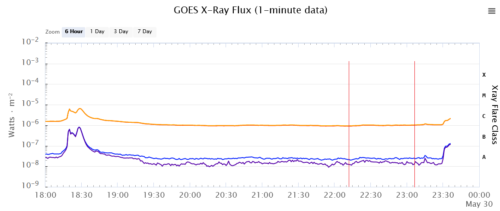

# wspr-reports
Reports and charts for amateur radio wspr hf performance using propagation accuracy measurements 

## wspr data
Copy-paste data directly from wsprnet.org database query results page and save the data as 'wspr.txt' in the script folder. See example wspr.txt data in the repo. 

Be sure to save the headers with the data (api forthcoming)  

## xray data
Save GOES `xrays-6-hour.json` directly to same folder from https://services.swpc.noaa.gov/json/goes/primary/  
See example GOES data in the repo. 

## usage
Requirements - numpy and pandas  (`pip install`)

Execute:  
`python wspr-reports.py`    
The wspr and xray data will be joined on timestamp. Raw data outputs:
1. wspr data with additional fields of direction from your location and distance classification
2. Joined wspr and GOES data on timestamp
3. View of reporter callsigns by map direction (using azimuth) from your location with SNR mean and standard deviation from at least 2 reports
4. View of reporter callsigns by distance, SNR list, slope trend of the SNR, std deviation, and variance
5. View of reporter callsigns by distance, GOES flux
6. Mean of the trending slopes and variancesof SNR reports by map direction from your location (+slopes - trending stronger, -slopes - weaker)

## notes
Note that wspr SNRs vary by a standard deviation of typically around 2.0+ even when xray flux is low and steady. This is independent of distance. Example:  
KD2OM at 1270 km had snr reported values of [-11, -16, -13, -13] over a 45 min span midday on 30m -> std dev = 2.06,  variance = 4.2   
or   
LX1DQ at 6885 km had snr values of [-16, -19, -19, -18, -16, -14, -16] over 1 hour span midday on 30m ->std dev = 1.86, variance = 3.5  

Data measurements over 1-2 hours should consider D-layer ionization variability based on time of day, frequency and GOES spikes. Also, using SNRs for antenna performance characteristics should consider the std dev variability of SNR reports along with sporadic receptions from reporters that may appear or fade based on atmospheric changes. 

Changing antenna configurations and using this data to understand performance should consider multiple wspr calls throughout the day over a number of days. Shorter measurements can lead to misinterpreted results.

## example range of data

## release
v0.0.1 - 05/29/2023

Thank you!  KN0VA