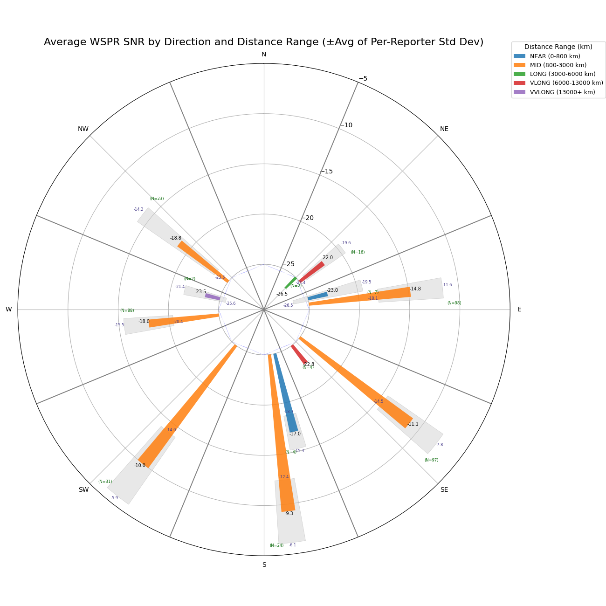
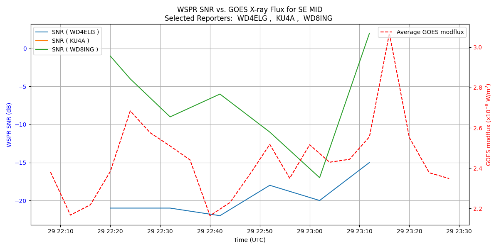

# wspr-reports
Reports and charts for amateur radio wspr hf performance using propagation accuracy measurements. The goal is to determine HF antenna performance based on a time series collection of wspr signal reports. Reports are saved as CSV files for analysis either using plots, spreadsheets or other tools.

## Background
Many amateurs utilize wspr reports to determine their overall HF system performance. However, widely variable factors affect wspr reports by distant stations. These can include time of day, solar x-ray flux, ionospheric variations, etc.   
**Relying on short duration wspr reports can lead to false assumptions and correlations regarding performance**.  

For these reports GOES 16-short data is joined with the wspr data to determine x-ray flux over the measured time period.  

## Examples
30m WSPR for 80 minutes ~22:00 UTC

This graph shows the 30 meter wspr SNR means and std deviations by azimuth direction (N, NE, E, SE, S, SW...) from my location (determined by the wsprnet.org data) based on the number of reception reports by monitoring callsigns. The bars radiating from the center show the mean SNR report (**longer bar means stronger mean signal reports from that general direction**) with the Std Dev being the gray at the end of each. The colors of the bars represent the distance ranges for the groups of reporters in the mapped direction. There are also small labels (N=value) showing how many reporters are in the direction/range.

For example - for the general E direction, reporting stations located between 800 and 3000 km (orange bars) have a mean SNR of -14.8 db from 98 reports with a std dev of 3.2 db. Whereas, close stations 0 - 800 km have a mean of -23.0 db from only 7 reports with a std dev of 3.5 db. There were no reception reports from stations E over 3000 km.

Here's what the data looks like:
 
`map  km   Reporter        count    mean       std     min    25%   50%    75%   max`  
`S   731   AC0G            1.0 -29.000000        NaN -29.0 -29.00 -29.0 -29.00 -29.0`  
`    734   KV0S            3.0 -13.000000   1.732051 -14.0 -14.00 -14.0 -12.50 -11.0`  
`    918   K6RFT           7.0   0.285714   3.728909  -6.0  -1.50   2.0   3.00   3.0`  
`    1164  W5JVS           6.0  -6.833333   3.600926 -12.0  -8.00  -7.0  -6.00  -1.0`  
`    1475  KG5ABO          1.0 -21.000000        NaN -21.0 -21.00 -21.0 -21.00 -21.0`  
`    1720  N5TTT           2.0 -18.000000   2.828427 -20.0 -19.00 -18.0 -17.00 -16.0`  
`    1733  N5BIA           1.0 -17.000000        NaN -17.0 -17.00 -17.0 -17.00 -17.0`  
`    2185  WB5B            7.0 -15.714286   2.429972 -19.0 -17.50 -16.0 -13.50 -13.0`  

In this data example, all of my 5w 30m SNR reports received south (S) of my location over a 1 hour timespan show the number of received reports (count), the mean of the wspr report in db and the std deviation of the reports. K6RFT at 1164 km away in MO reported most often (7x) with a mean SNR report of ~0db and a std deviation of 3.72.   
**A std deviation of 3.72 is a wide range of reception reports (min = -6.0db to max = 3.0db or a 9db variation in one hour)**

The next report excerpt shows the time-series values of the SNR reports for 3 randomized station in the SE within the range (800 - 3000 km) compared to the GOES flux at the time. In this example three reporting stations (WD4ELG, KU4A and WD8ING) are mapped with the GOES flux (red dotted line) at the same time.

# Usage
Requirements - Python 3.10 or greater

Install modules: numpy, pandas, matplotlib - run (`pip install numpy pandas matplotlib`)

Run `python wspr-reports.py` to generate graphs (you can run it immediately against the sample data or gather your own data first - see next)

## transmit wpsr
Transmit wspr from your location for a specified time period (1-2 hours is a good baseline)  

## wspr data
Copy-paste your data directly from https://www.wsprnet.org/drupal/wsprnet/spotquery database query results page and save the data as `wspr.txt` in the script folder. See example wspr.txt data in the repo. 

**Be sure to save the headers with the data (api forthcoming)**  

## xray data
You can run this script with the `python wspr-reports.py -x` flag to automatically save the the GOES `xrays-6-hour.json` data. Do this only once, otherwise the time series will be overwritten and continue without WSPR data. You an also just manually download GOES `xrays-6-hour.json` directly to same folder from https://services.swpc.noaa.gov/json/goes/primary/ soon after finishing up WSPR trasmissions.
See example GOES data in the repo. 

Map direction is determined by your callsign location in the wspr.org results with this mapping deg to direction:  
[0, 23, 68, 113, 158, 203, 248, 293, 337, 359] map to labels ['N', 'NE', 'E', 'SE', 'S', 'SW', 'W', 'NW', 'N']

## after execution
The wspr and xray data will be joined on timestamp. Raw data outputs:
1. wspr data with additional fields of direction from your location and distance classification (file only)
2. Joined wspr and GOES data on timestamp 
3. View of reporter callsigns by map direction (using azimuth) from your location with SNR mean and standard deviation 
4. View of 3 random reporter callsigns by one distance range along with the GOES data at the time

Data is saved as .png and .csv files in the script directory 

## example on how to use
 - KN0VA transmitted wspr on 30m for about 1 hour 
 - The GOES and wspr data is joined together by timestamp in a file
 - For reports  - the wspr data has the lat/lon of KN0VA to determine map direction
    - the data file `wspr-map-trends.csv` shows that wspr reporter KX4AZ/T which is 617km East of KN0VA has 7 reception reports with a wspr mean of -23.0 db and standard deviation of 3.5 db with a minimum report of -27.0 db / maximum of -17.0 db
 - For the polar plot above 
    - the report shows 31 reporter receptions SW in the range of 800-3000 km with a mean SNR of -10.0db and no other reports from any other ranges

## Notes
Note that wspr SNRs vary by a standard deviation of typically around 2.0+ db even when xray flux is low and steady. This is independent of distance. 

Example:  
KD2OM at 1270 km had snr reported values of [-11, -16, -13, -13] over a 45 min span midday on 30m -> std dev = 2.06,  variance = 4.2   
or   
LX1DQ at 6885 km had snr values of [-16, -19, -19, -18, -16, -14, -16] over 1 hour span midday on 30m ->std dev = 1.86, variance = 3.5  

Data measurements over 1-2 hours should consider D-layer ionization variability based on time of day, frequency and GOES spikes. Also, using SNRs for antenna performance characteristics should consider the std dev variability of SNR reports along with sporadic receptions from reporters that may appear or fade based on ionospheric changes. 

**Changing antenna configurations and using this data to understand performance should consider multiple wspr calls throughout the day over a number of days. Shorter measurements can lead to misinterpreted results.**

## example range of data

## release
v0.0.1 - 05/29/2023  
v0.0.2 - 07/17/2023  
v0.0.3 - 05/31/2025

Thank you!  KN0VA